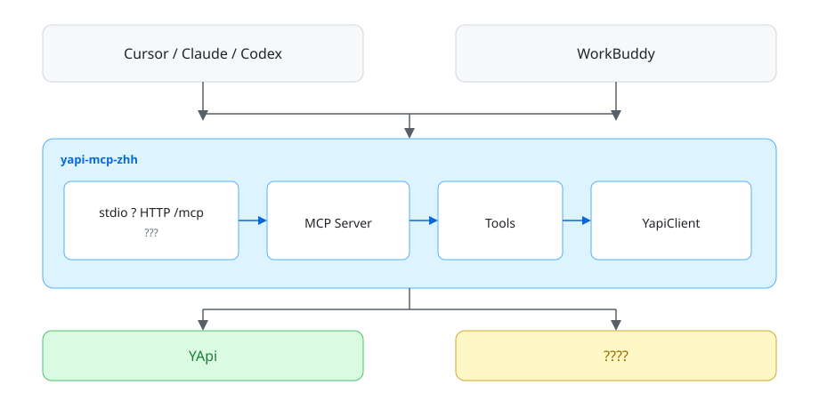

# yapi-mcp-zhh

**YApi Mock MCP**：面向 [YApi](https://github.com/YMFE/yapi) 的 [MCP](https://modelcontextprotocol.io) 服务。在支持 MCP 的客户端里列出项目、搜索/新建接口、改 Mock（返回体、高级脚本、期望），并打 mock URL 确认是否生效。

包名与仓库均为 `yapi-mcp-zhh`。

需要：**Node.js 20+**，以及本机能访问目标 YApi（内网即可）。

## 架构

客户端只走 MCP；本进程把工具转成对 YApi 的 HTTP。stdio 和 HTTP 共用同一套 Tools / `YapiClient`。



未配 `YAPI_BASE_URL` 或 `YAPI_DEMO=true` 时走演示，不写真实 YApi。`npm start` 额外提供浏览器演示台，和 MCP 是同一套 Tools。

## 能做什么 / 不能做什么

YApi Mock 生效顺序：**期望 > 高级脚本 > 接口返回体**。

| 能力 | 说明 | 鉴权 |
| --- | --- | --- |
| 列项目、搜接口 | 登录账号能看到的分组/项目 | 登录态 |
| 新建接口 | 标题、路径、方法、分类；可选顺带写返回体 | 登录态 |
| 读/改普通 Mock（`res_body`） | 接口编辑页里的返回数据 / JSON Schema | **项目 Token** |
| 读/改高级 Mock 脚本 | 官方 advanced-mock 插件，整段覆盖 | 登录态 |
| 增删改 Mock 期望 | 按请求参数匹配不同 JSON | 登录态 |
| 试打 Mock | `GET/POST …/mock/{projectId}{path}` | 一般不需要登录 |

**不会做：** 改请求参数文档、删接口、改项目设置、部署业务代码。

项目 Token 和登录密码不是一回事：Token 只管普通返回体；脚本和期望必须登录（或 Cookie）。

## 安装

```bash
git clone https://github.com/zhanghaha416/yapi-mcp-zhh.git
cd yapi-mcp-zhh
npm install
npm run build
```

编译后 stdio 入口：

```text
dist/server/mcp-stdio.js
```

请使用该文件的**绝对路径**。也可 `npm run mcp`（等价 `node dist/server/mcp-stdio.js`）。

## 接入方式

标准 MCP：本机用 **stdio**（客户端拉起 `dist/server/mcp-stdio.js`，不必 `npm start`），或连已启动的 **HTTP** `/mcp`。模板：[share/mcp.stdio.json](share/mcp.stdio.json)、[share/mcp.http.json](share/mcp.http.json)。

`command` 建议用 Node 20+ 的绝对路径，避免客户端默认到旧 Node。

stdio 配置骨架（改绝对路径和账号）：

```json
{
  "mcpServers": {
    "yapi-mock": {
      "command": "node",
      "args": ["/absolute/path/to/yapi-mcp-zhh/dist/server/mcp-stdio.js"],
      "env": {
        "YAPI_BASE_URL": "http://yapi.example.com",
        "YAPI_PROJECT_TOKENS": "111:tokenA,222:tokenB",
        "YAPI_EMAIL": "you@example.com",
        "YAPI_PASSWORD": "your-password"
      }
    }
  }
}
```

### Cursor、Claude、Codex

这几家 JSON 几乎一样，都是 `mcpServers` + `command` / `args` / `env`（HTTP 则是 `url` + `headers`）。差别主要是**写到哪个文件**：

| 客户端 | 常见做法 |
| --- | --- |
| Cursor | `~/.cursor/mcp.json`，或 Settings → MCP → 编辑配置 |
| Claude Desktop | 官方 MCP 配置文件（同样贴上一段） |
| Codex | 按其 MCP 文档写入，字段与上面相同 |

保存后刷新 MCP 列表，应出现 `yapi-mock`。

### WorkBuddy

JSON 可以原样用上面这段，但入口不一样：

1. WorkBuddy → **Connections → Custom connections → Configure MCP**（会打开本机 `~/.workbuddy/mcp.json`）。
2. 把 `yapi-mock` 合并进去并保存。
3. 在连接管理里把该 MCP **打开开关**，工具才会进对话（只存文件、不打开开关，经常调不到）。

HTTP 模式把 `share/mcp.http.json` 里的 `url` / `Authorization` 写进同一文件即可。

### HTTP（一台机器给多人）

```bash
cp .env.example .env
# 填写 YApi 地址、Token、登录账号
# 连真 YApi 时必须设置 MCP_HTTP_AUTH_TOKEN（例如 openssl rand -hex 24）
npm install
npm run build
npm start
```

默认：

| 地址 | 用途 |
| --- | --- |
| `http://127.0.0.1:43181/mcp` | MCP（Streamable HTTP） |
| `http://127.0.0.1:43181/` | 本机演示台（浏览器） |

客户端示例：

```json
{
  "mcpServers": {
    "yapi-mock": {
      "url": "http://host:43181/mcp",
      "headers": {
        "Authorization": "Bearer <与服务器 MCP_HTTP_AUTH_TOKEN 相同>"
      }
    }
  }
}
```

写出的 Mock 都算**服务器上那个 YApi 账号**。不要把端口暴露到公网。

## 环境变量

可写在客户端 `env` 里，HTTP 模式也可写在 `.env`（见 `.env.example`）。

| 变量 | 必填 | 说明 |
| --- | --- | --- |
| `YAPI_BASE_URL` | 接真环境时必填 | YApi 源站，末尾不要 `/`。不填或 `YAPI_DEMO=true` 时走内存演示，不会写入真实 YApi |
| `YAPI_PROJECT_ID` | 否 | 工具省略 `projectId` 时的默认项目 |
| `YAPI_TOKEN` | 改普通返回体时需要 | 单个项目 Token（项目 → 设置 → Token） |
| `YAPI_PROJECT_TOKENS` | 多项目时推荐 | `项目ID:token`，逗号分隔。切项目不用改配置，对话里带项目 ID 即可 |
| `YAPI_EMAIL` / `YAPI_PASSWORD` | 列项目、新建接口、脚本、期望需要 | LDAP 把登录名填在 EMAIL |
| `YAPI_COOKIE` | 否 | 浏览器里的 `_yapi_token=…; _yapi_uid=…`，可代替密码 |
| `YAPI_INSECURE_TLS` | 否 | 内网 HTTPS 证书不受信任时设为 `true` |
| `YAPI_DEMO` | 否 | `true` 强制演示后端 |
| `PORT` | 否 | HTTP / 演示台端口，默认 `43181` |
| `MCP_HTTP_AUTH_TOKEN` | 连真 YApi 的 HTTP MCP 必填 | 客户端放在 `Authorization: Bearer` |

密钥只放在本地客户端配置或 `.env` 中，不要提交到 git。

## 工具一览

| 工具 | 做什么 |
| --- | --- |
| `yapi_list_projects` | 列出当前账号能看到的项目 |
| `yapi_search_interfaces` | 按标题、路径、方法搜索；`keyword` 为空则列出（受已知项目 ID 限制） |
| `yapi_create_interface` | 新建接口。不传分类时优先「公共分类」，否则第一个分类；可带 `resBody` |
| `yapi_get_interface_mock` | 读返回体和 mock URL |
| `yapi_update_interface_mock` | 写普通 Mock 返回体 |
| `yapi_get_advanced_mock` / `yapi_update_advanced_mock` | 读/覆盖高级脚本 |
| `yapi_list_mock_cases` / `yapi_save_mock_case` / `yapi_delete_mock_case` | Mock 期望 |
| `yapi_call_mock` | 请求 mock URL，确认写入是否生效 |

新建接口主要参数：`title`、`path`，可选 `method`（默认 GET）、`projectId`、`catId` / `catName`、`resBody`。

对话里可以这样试：

> 列出我能访问的 YApi 项目，再搜 /api/order/list  
> 在某项目新建 GET /mcp/ping，返回 `{"ok":true}`，并打一次 mock

## 仅本地演示

```bash
npm install
npm run build
npm start
```

打开 `http://127.0.0.1:43181`。数据在进程内存里。stdio 把 `YAPI_DEMO` 设为 `true`、或不设 `YAPI_BASE_URL`，效果相同。

开发热更新：`npm run dev`。

## 常见问题

**客户端起不来 MCP**  
stdio 的 `args` 不是绝对路径，或还没 `npm run build`。Node 版本低于 20 也会失败。

**搜接口不知道项目**  
配 `YAPI_PROJECT_ID`，或 `YAPI_PROJECT_TOKENS=项目ID:token`。也可以先调 `yapi_list_projects`（需要登录）。

**改返回体失败、改脚本提示请登录**  
普通返回体要项目 Token；脚本/期望/新建/列项目要 `YAPI_EMAIL` + `YAPI_PASSWORD` 或 `YAPI_COOKIE`。

**切项目还要改配置吗**  
不用。把常用项目写进 `YAPI_PROJECT_TOKENS`。只有新项目要改普通返回体、且还没配过 Token 时才补一行。

**改了但前端还是旧数据**  
用 `yapi_call_mock` 打 `{YAPI_BASE_URL}/mock/{项目ID}{接口路径}`。浏览器缓存或本地代理没指到 YApi mock 时，页面不会变。

## 开发

```bash
npm test
npm run typecheck
```

协议实现：`@modelcontextprotocol/sdk`。stdio 入口 `src/server/mcp-stdio.ts`，HTTP 挂载 `src/server/mcp-http.ts`。
